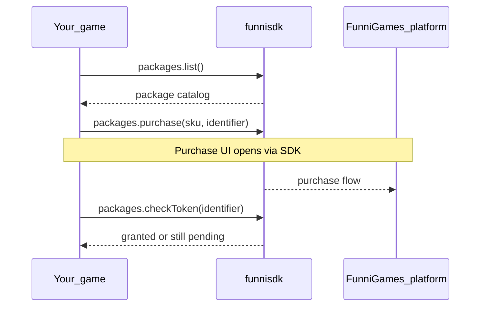

# FunniGames JS SDK — Demo Project

Interactive sample app for [`funnisdk`](https://www.npmjs.com/package/funnisdk). Use it to explore the SDK APIs while your game runs **inside the FunniGames platform iframe** — not as a standalone browser tab.

## What it demonstrates

| Section | SDK API | Purpose |
|---------|---------|---------|
| Profile | `profile.getProfile()` | Load logged-in player data |
| Save / Load | `profile.saveData()` / `getData()` | Persist custom game state by key |
| Game Packages | `packages.list()` / `purchase()` / `checkToken()` / `listOwned()` | Catalog, purchase flow, verify grant |
| Leaderboard | `leaderboard.addScore()` / `getLeaderboard()` | Submit and read scores |

Each action shows the JSON response in the card and logs recent events at the bottom.

## Prerequisites

- A game registered on the FunniGames platform with your demo URL configured
- Access to open the game through the platform play page (logged-in test user)
- At least one active game package on your game (for package tests)

## Local setup

### 1. Install and run the demo

```bash
npm install
npm run dev
```

This installs `funnisdk` from npm along with the demo app.

Default Vite URL: `http://localhost:5173` (check terminal output).

### 2. Connect your game URL

Set your registered game URL to the demo origin, for example:

```
http://localhost:5173
```

Then open the game from the **FunniGames play page**, not by visiting the dev server URL directly.

> SDK initialization requires the platform parent window (`postMessage` bridge). Opening `localhost:5173` in a new tab will fail.

## Game packages flow

Your game only talks to the SDK. Platform context (current game, purchase UI, login) is handled outside your iframe.



### Steps in the demo UI

1. **List Packages** — catalog for the current game (`sku`, `name`, `price`, `currency`)
2. Select **SKU** from the dropdown
3. Enter a unique **identifier** (your game’s token, e.g. `level-3-bonus`)
4. **Buy Package** — opens the platform purchase UI
5. Complete payment on the platform
6. **Check Token** or **List Owned** — confirm the package was granted

## Project layout

```
src/
  App.tsx       # Demo UI (sections, hints, JSON output)
  App.css       # Styles
  methods.ts    # Thin wrappers around FunniGamesSDK
  main.tsx      # React entry
```

SDK calls live in `methods.ts`. Do not call backend APIs directly from the game — use the SDK only.

## Scripts

| Command | Description |
|---------|-------------|
| `npm run dev` | Vite dev server |
| `npm run build` | Typecheck + production build |
| `npm run preview` | Preview production build |
| `npm run lint` | ESLint |

## Troubleshooting

### `SDK initialization result: false`

- Game is not embedded in the FunniGames platform iframe
- Parent message handlers not ready — refresh the play page
- Game URL origin mismatch — the host only accepts `postMessage` from the configured game origin

### Purchase UI does not open

- User must be logged in on the platform
- SKU must exist and be active for this game
- **identifier** must be non-empty

### In-page alerts ignored

The play iframe may use `sandbox` without modal dialogs. This demo uses in-page status banners instead of `alert()`.

### Package list empty

- Create and activate packages for your game in the platform admin
- Ensure the package belongs to the game you are testing

## Documentation

- SDK API reference: [`funnisdk` on npm](https://www.npmjs.com/package/funnisdk)

## License

Same terms as the FunniGames SDK — see your integration agreement.
